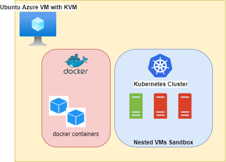
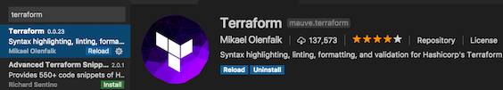

# K8s Lab sandbox

Get a k8s cluster lab running in a few minutes.

You will need:

SSH keys set on your environment (cloud shell or WSL terminal)
Ubuntu 18.04 machine with at least 4 cores and 16 G of RAM
+100 GB of additional storage
Ubuntu 18.04 cloud image




## Prerequisites

For this setup, you will need:

* A [Github](https://github.com/) account
* An [Azure](https://azure.microsoft.com/) account
create your Azure account for [free](https://azure.microsoft.com/en-us/free/)
* The Terraform [binary](https://www.terraform.io/downloads.html)

Another option is to use the Cloud Shell on Azure at [https://shell.azure.com](https://shell.azure.com)

The examples here will use [Microsoft Azure](https://azure.microsoft.com/en-us/). For more information please refer to the Before You Begin section.


* Azure CLI 2.0 (more instructions below)

## Microsoft Azure CLI 2.0

### Install the Microsoft Azure CLI 2.0

Follow the Azure CLI 2.0 [documentation](https://docs.microsoft.com/en-us/cli/azure/install-azure-cli) to install the `az` command line utility. You can install utility in various platforms such as macOS, Windows, Linux (various distros) and as a Docker container.

The examples here are based on the version 2.25.0 of the utility. You can verify the version of the tool by running:

```
az --version
```

> Note: If this is your first time using the Azure CLI tool, you can familiarize yourself with it's syntax and command options by running `az interactive`

### First Things First

Before we can use Azure, your first step, aside from having an account, is to login. Once Azure CLI is installed, open up a terminal and run the following:

```
az login
```

This will prompt you to sign in using a web browser to https://aka.ms/devicelogin and to enter the displayed code. This single step is needed in order to allow `az` to talk back to Azure.

## Basic setup - Do this before proceeding

The first thing you should do is to clone this repo as most of the examples here will do relative reference to files.
 

Before we proceed, please do this now:

1. Clone this repo:
  ```bash
  git clone https://github.com/santi1s/k8s-lab.git
  ```
2. If you are using VS Code, install the Terraform extension:




### - Installing Terraform

Terraform is distributed as a binary package for various OSes, including: Linux, MacOS, OpenBSD, FreeBSD, Windows and Solaris.

Download the binary at: [https://www.terraform.io/downloads.html](https://www.terraform.io/downloads.html)

Another option is to use the Cloud Shell on Azure at [https://shell.azure.com](https://shell.azure.com)

### - Verifying the Installation

Run the following command on a terminal: `terraform`. You should see an output similar to this:

```bash
$ terraform
Usage: terraform [--version] [--help] <command> [args]

The available commands for execution are listed below.
The most common, useful commands are shown first, followed by
less common or more advanced commands. If you're just getting
started with Terraform, stick with the common commands. For the
other commands, please read the help and docs before usage.

Common commands:
    apply              Builds or changes infrastructure
    console            Interactive console for Terraform interpolations
    destroy            Destroy Terraform-managed infrastructure
    env                Workspace management
    fmt                Rewrites config files to canonical format
    get                Download and install modules for the configuration
    graph              Create a visual graph of Terraform resources
    import             Import existing infrastructure into Terraform
    init               Initialize a Terraform working directory
    output             Read an output from a state file
    plan               Generate and show an execution plan
    providers          Prints a tree of the providers used in the configuration
    push               Upload this Terraform module to Atlas to run
    refresh            Update local state file against real resources
    show               Inspect Terraform state or plan
```

More on the [Terraform website](http://www.terraform.io).

### - Setting up access to Azure

Terraform uses an Azure AD service principal to provision resources on Azure. Here we have two options:

1. Manually setup the service principal as described [here](https://docs.microsoft.com/en-us/azure/virtual-machines/linux/terraform-install-configure#set-up-terraform-access-to-azure)
1. Use the [setup_terraform.sh](https://github.com/santi1s/k8s-lab/blob/master/tools/setup_terraform.sh) found under the `tools/` directory. 

Procedure:

1. If not done already, log into Azure
   ```bash
   $ az login
   ```
1. Next, select a SUBSCRIPTION
   ```bash
   $ az account list -o table
   ```
1. The output should look similar to this

<pre><code>
  Name                                CloudName    SubscriptionId  State    IsDefault
  ----------------------------------  -----------  --------------  -------  ---------
   Visual Studio Enterprise            AzureCloud   XXXXXXXX-XXXX.  Enabled  True
   ...
</code></pre>

Execute the `setup_terraform.sh` script:

  ```bash
  $ cd tools/
  $ chmod +x setup_terraform.sh
  $ SUBSCRIPTION=XXXXXXXXXX
  $ ./setup_terraform.sh -s $SUBSCRIPTION
  ```

  OUTPUT
  ```bash
  Setting up the subscription
  ----------------------------------------------------------
  $ az account set --subscription=XXXXXXXXXXXXX
  Retrying role assignment creation: 1/36
  Setting environment variables for Terraform
  ----------------------------------------------------------
  $ source terraform.rc
  Here are the Terraform environment variables for your setup
  ----------------------------------------------------------
  export ARM_SUBSCRIPTION_ID="XXXXXXXXX"
  export ARM_CLIENT_ID="XXXXXXXXX"
  export ARM_CLIENT_SECRET="XXXXXXXX"
  export ARM_TENANT_ID="XXXXXXX"
  ----------------------------------------------------------
  Setup is done. Your Terraform variables were saved on the terraform.rc file.
  ```


### K8s-lab Terraform Setup

  
### - Core files

Reference files are under: `infra/k8s-lab/`

| File         | Comment       |
|:------------- |:------------- |
| main.tf      | This is our core file. All of the definitions are here |
| outputs.tf   | Defines the output from `terraform show` |
| variables.tf | Defines the variables and default values used on `main.tf` |
| common.tfvars| User defined values for the variables.red[*] |

We will also run a few commands after the VM is up and running as defined on the file
`tools/kvm_setup.sh`.

* You will be editing this file.

### - Default values

The following table shows our default values:

| Parameter | Default Value |
| :- | :- |
| vm_size | Standard_D4s_v3  |
| location | WestEurope |
| Admin user.red[*] | azureuser |
| VNet | 10.0.0.0/16 |
| Management Subnet | 10.0.1.0/24 |


* Admin user will connect with ssh using public and private key pair

## What resources are we creating ? 

- azurerm_resource_group
- azurerm_virtual_network
- azurerm_subnet
- azurerm_network_security_group
- azurerm_network_interface
- azurerm_public_ip
- azurerm_storage_account
- azurerm_managed_disk
- azurerm_virtual_machine
- azurerm_virtual_machine_extension

## Deploying the k8s-lab VM

1. `terraform init`
2. `terraform plan -var-file=common.tfvars -out k8s-lab-infra`
3. `terraform apply "k8s-lab-infra"`
4. Connect to the vm: `terraform show`

```bash
ssh azureuser@<publicIp>
```

## Cleaning up

1. `terraform destroy -var-file=common.tfvars`

Say `yes` when you see this prompt:

<pre><code>
  Do you really want to destroy?
  Terraform will destroy all your managed infrastructure, as shown above.
  There is no undo. Only 'yes' will be accepted to confirm.

  Enter a value: .red[yes]
</code></pre>

## More Terraform Examples in 

- Terraform Examples on Azure [https://github.com/hashicorp/terraform/tree/master/examples](https://github.com/hashicorp/terraform/tree/master/examples)

- Terraform Resources on Azure: [https://www.terraform.io/docs/providers/azurerm/index.html](https://www.terraform.io/docs/providers/azurerm/index.html)

- Terraform Up and Running - Awesome book on Terraform !
